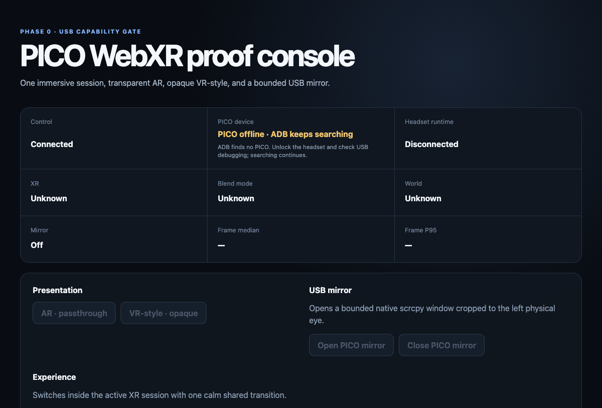
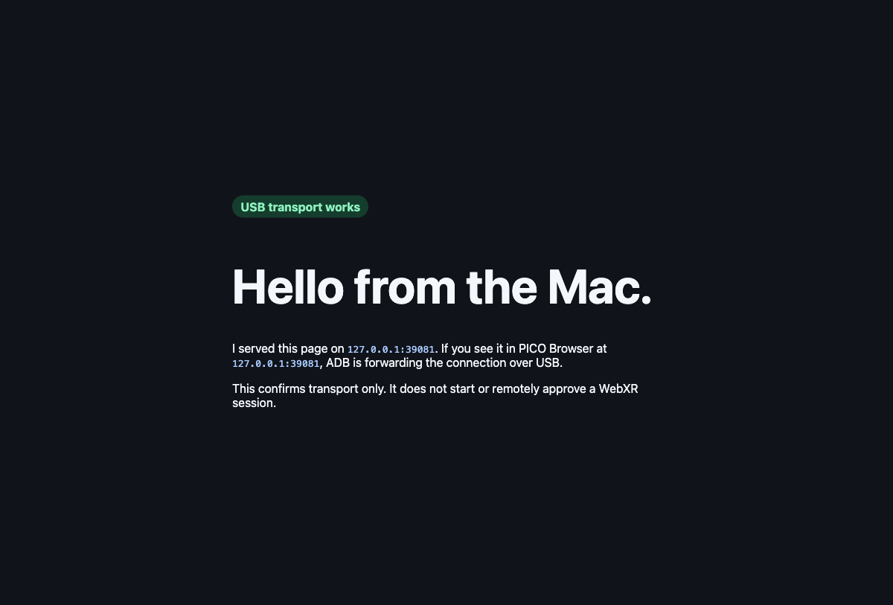

<!--
Purpose: Introduce the repository and route readers to the right PICO control example.
Context: The repository combines USB device control, local browser transport, and WebXR application control.
Responsibilities: Explain the control layers, quick starts, project structure, and verification boundary.
Boundaries: Detailed operation and implementation guidance lives in docs and example-specific READMEs.
-->

# PICO Remote Control

I use this repository to show three practical ways to control a PICO headset from a Mac over a
USB-C cable. The examples start with direct Android device commands, continue with a minimal local
browser connection, and finish with a complete dashboard-controlled WebXR experience.

The important distinction is that “remote control” can mean different things:

| Goal | Technique | Start here |
| --- | --- | --- |
| Inspect, mirror, capture, install, or reboot the headset | USB ADB and scrcpy | [`tools/picoctl`](tools/picoctl/) |
| Make a local Mac webpage reachable in PICO Browser | `adb reverse` and an Android URL intent | [`examples/adb-reverse-minimal`](examples/adb-reverse-minimal/) |
| Control a running WebXR application and read confirmed state | Bun, WebSockets, Three.js, and WebXR | [`examples/webxr-dashboard`](examples/webxr-dashboard/) |

These techniques complement each other. ADB can bootstrap the browser connection, but it does not
own WebXR application state. A WebSocket can request a world change, but it cannot supply the user
intent required to enter an immersive WebXR session.

## System overview

```text
Mac
├── terminal ── picoctl ── ADB / scrcpy ──────────────── PICO OS
└── dashboard ── Bun server ── WebSocket ─────────────── PICO Browser
                           └── ADB reverse over USB-C       └── WebXR runtime
```

The PICO performs the XR rendering. The Mac serves local files, sends validated commands, reports
confirmed headset state, and can open a deliberately bounded scrcpy preview.

## Demo previews

### WebXR operator dashboard



The desktop dashboard distinguishes its own connection, the USB device, and the headset runtime.
The screenshot shows the honest no-headset state used during browser validation.

### Minimal USB transport page



This page is intentionally small: seeing it at the PICO loopback address proves only that the USB
reverse transport works. It does not claim or approve an immersive session.

## Quick start

### Direct device control

```bash
cd tools/picoctl
./picoctl status
./picoctl eye
```

### Minimal local browser transport

```bash
cd examples/adb-reverse-minimal
bun run server.ts
```

Then follow the example README to create the USB reverse mapping and open the page in PICO Browser.

### Complete WebXR dashboard

```bash
cd examples/webxr-dashboard
bun install --frozen-lockfile
bun run dev
```

Open `http://127.0.0.1:5173/dashboard.html` on the Mac. The server restores its USB reverse mapping
and opens the headset page when one authorized PICO is available. Put on the headset and select
`Enter XR` once.

## Documentation

- [Setup](docs/setup.md) — install the host tools and authorize the headset.
- [Control strategies](docs/control-strategies.md) — choose the right control layer.
- [Architecture](docs/architecture.md) — understand ownership and data flow.
- [WebXR dashboard guide](docs/webxr-dashboard.md) — build on the complete example.
- [Enterprise, kiosk, streaming, and passthrough](docs/enterprise-kiosk-and-passthrough.md) — separate
  PICO Business features from the local USB and WebXR demos.
- [Troubleshooting](docs/troubleshooting.md) — diagnose USB, ADB, browser, XR, and mirror failures.
- [Validation](docs/validation.md) — see what is automated, what was tested on hardware, and what
  still requires a physical headset.

## Scope

I deliberately keep this repository local, cable-first, and small:

- one Mac and one explicitly selected or uniquely connected PICO;
- USB ADB rather than Wi-Fi discovery or fallback;
- local content rather than arbitrary URL proxying;
- one persistent `immersive-ar` session in the complete demo;
- no cloud accounts, fleet management, database, or custom media protocol.

## Verification

Run the repository checks from the root:

```bash
./scripts/check.sh
```

Automated checks do not prove headset-specific WebXR behavior. Passthrough, opacity, comfort,
frame timing, cable recovery, and long-running stability still need the physical target device.

## License and assets

The source code and documentation are available under the [MIT License](LICENSE). The included 3D
models are CC0 Poly Pizza assets; their source IDs, creators, licenses, and local geometry metadata
are recorded beside the files in the WebXR example.
